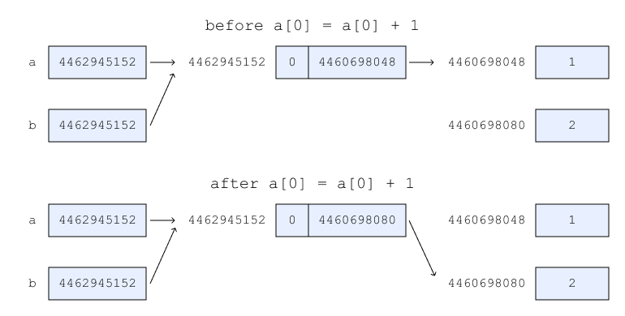

# Thinking About Variables

This lesson assumes the reader has already seen simple Python programs, including assignment statements using numeric, string, and list types. They should also have seen simple function definitions, such as a function to sum two values, and the use of the `pass` keyword.

## Variables Let Us Store Values

Let's consider the following code.

```python
a = 1  # a gets 1
b = a  # b gets a copy of a
a = a + 1  # add 1 to a and store the result back in a

print(f'a: {a}')
print(f'b: {b}')
```

*Ex 1. Incrementing a number.*

Running this code produces the following output.

```text
a: 2
b: 1
```

We can explain the behavior of this code as follows:

1. `a = 1` stores the value `1` in the variable `a`.
2. `b = a` copies the value stored in `a` into the variable `b`.
3. `a = a + 1` takes the value stored in `a` (1), adds `1` to it (2) and stores that result back into `a`, replacing the previous value.
4. We print out the the results.

We can think of each of the variables as a box that get updated with each of the steps that we described.


*Fig 1. a gets 1. b gets a. a gets a + 1. Or does it?*

So is that it? Is that all there is to working with variables?

## Variables With Complex Data

Let's consider this similar code.

```python
a = [1]  # a gets a list containing the number 1
b = a  # b gets a copy of a???
a[0] = a[0] + 1  # add 1 to the value in a[0] and store the result back in a[0]

print(f'a: {a}')
print(f'b: {b}')
```

*Ex 2. Incrementing a number in a list.*

We might guess this code will produce the following:

```text
a: [2]
b: [1]
```

But instead, we see this!

```text
a: [2]
b: [2]
```

Has something gone wrong? Is there an error in our code?

We might try to explain this code as before.

1. `a = [1]` creates a new list containing the value `1` in position 0, and stores the list in the variable `a`.
2. `b = a` copies the list stored in `a` into the variable `b`???
3. `a[0] = a[0] + 1` takes the value stored in position 0 of the list stored in `a` (1), adds `1` to it (2) and stores that result back into position 0 of the list stored in `a`, replacing the previous value.
4. We print out the the results.

Using our box model from before, this would resemble the following:

![Fig 2. a gets [1]. b gets a. a[0] gets a[0] + 1. Maybe?](figures/python-variables-list-a-b-1.png)

*Fig 2. a gets [1]. b gets a. a[0] gets a[0] + 1. Maybe?*

By that explanation, our first guess about what result we would see should have been correct. But instead, we see that the addition in step 2 seemed to affect both `a` and `b` at the same time.

## Checking Whether Variables Can Refer to the Same Value

How might it be that modifying a value in `a` also modifies a value in `b`. What if `a` and `b` actually refer to the same value? In this case, the same list. Is there a way we can confirm this?

### The `id` Function

Every value in Python is tracked by a unique identifier. We can ask Python what any value's identifier is by using the built in `id` function. We can think of this identifier as the _address_ of that value in the program.

>In the standard Python interpreter, these identifiers are more than just _like_ the address of the value, they actually _are_ the address of the value, stored in the memory of the computer!

The `id` function can be called on any value, such as `None`, `1`, `2`, `""`, `"dog"`, `"cat"`, `[]`, `{}`, really anything we can think of. Recalling our knowledge of how Python evaluates expressions, any expression that produces a value will also work, since the resulting value is what the `id` function will receive.

The full details of the [`id` function](https://docs.python.org/3/library/functions.html#id) are available in the official Python documentation.

Let's consider a few examples.

```python
# try out a few different values
print(f'id(None): {id(None)}')
print(f'id(1): {id(1)}')
print(f'id(2): {id(2)}')
print(f'id(1 + 1): {id(1 + 1)}')  # the same result as id(2)

# a function that adds two values
def addem(a, b):
    return a + b

print(f'id(addem(1, 1)): {id(addem(1, 1))}')  # the same result as id(2)

def does_nothing():
    pass

print(f'id(does_nothing()): {id(does_nothing())}')  # the same result as id(None)
```

*Ex 3. Some outputs from the `id` function.*

The result will resemble the following:

```text
id(None): 4494621808
id(1): 4494764480
id(2): 4494764512
id(1 + 1): 4494764512
id(addem(1, 1)): 4494764512
id(does_nothing()): 4494621808
```

The exact identifier values may differ on your own computer, but notice that the values for `id(None)` and `id(does_nothing())` are the same, since both result in a value of `None`. The values for `id(2)`, `id(1 + 1)`, and `id(addem(1, 1)` are also all the same, since they all result in a value of `2`. `id(1)` is different from the others, since it is the only call using a value of `1`.


*Fig 3. `id` returns the _address_ of a value.*

Notice in this example that none of the values we passed to `id` were stored in variables. The _addresses_ returned by `id` are the addresses of the values themselves. Each can be thought of as a label for that value, similar to our original idea about how values might be like boxes with a label on them.

### Back to `a` and `b`

Let's return to our original example and use our new understanding of `id` to see if we can get a better understanding of how it works.

```python
a = 1
b = a

print(f'a: {a}')
print(f'b: {b}')
print(f'id(a): {id(a)}')
print(f'id(b): {id(b)}')
print(f'id(1): {id(1)}')
print(f'id(2): {id(2)}')
print()

a = a + 1

print(f'a: {a}')
print(f'b: {b}')
print(f'id(a): {id(a)}')
print(f'id(b): {id(b)}')
print(f'id(1): {id(1)}')
print(f'id(2): {id(2)}')
```

*Ex 4. Inspecting the identifiers when a and b store numbers.*

This time, there are a lot more `print` statements, but we're still doing the same steps we did in the beginning. We're just checking on the values and their identifiers as we update the variables.

When we run this code, we will see something like this:

```text
a: 1
b: 1
id(a): 4439181760
id(b): 4439181760
id(1): 4439181760
id(2): 4439181792

a: 2
b: 1
id(a): 4439181792
id(b): 4439181760
id(1): 4439181760
id(2): 4439181792
```

Again, the exact identifier values may differ on your own computer. The values of `id(1)` and `id(2)` may even differ from the previous sample. In fact, they will probably be different every time the program runs! But we can observe in the first group of output, where `a` and `b` both have the value `1`, that `id(a)`, `id(b)`, and `id(1)` all have the same identifier. `id(2)` is different.

In the second group of output, where `a` is `2` and `b` is still `1`, we can observe that now `id(a)` and `id(2)` have the same value, which is the same as `id(2)` in the first group, while `id(b)` and `id(1)` still have the same value they had at the beginning.

The following diagram shows these two situations.


*Fig 4. How a and b change their values.*

This tells us something very important about how values and variables work together. Let's review our original explanation for `b = a`. We said that the variable `b` got a copy of the value in variable `a`. But from the `id` output, we see this is not true. They are the _same_ value. `a` and `b` do not have different copies of the value `1`. They refer to the same `1`. The same `1` as every other `1` in the program, since `id(1)` returns the same identifier.

Our explanation for `a = a + 1` is also slightly off. We see that the resulting identifier in `a` is the same value as `id(2)`. So `a` did _not_ directly contain the value `1`, which was updated to the value `2`. Instead, Python looked up the value that `a` referred to (1), added 1 to it (2), and stored a reference to the value `2` in `a`. We know this because now `id(a)` and `id(2)` are the same.

So now we might conclude that Python variables don't actually store values. Instead they store references to values that we can identify using the `id` function. We can think of the identifier as a unique address of the value inside the program. When we need to see what value there is in a variable, we check the address stored in the variable, and then go look at what is stored at that address.

## Python Variables Are References

As figure 4 shows, our variables hold the address of some value which is stored elsewhere in memory. We say that our variables hold _references_ to values. Some languages refer to these variables as _pointers_, and we might hear that term applied to Python variables as well. For now, we can treat them as synonymous terms.

This setup has some very useful benefits. For instance, arguments to functions can be passed very efficiently, no matter how large they are.

But there are also some potential pitfalls of which we need to be careful, especially around the use of references and complex data. Let's take another look at our list example, applying our newfound understanding of references.

## References and Lists

As we did with exploring identifiers, references, variables and numbers in our first example, let's add similar logging to our list example.

```python
a = [1]
b = a

print(f'a: {a}')
print(f'b: {b}')
print(f'id(a): {id(a)}')
print(f'id(b): {id(b)}')
print(f'id(a[0]): {id(a[0])}')
print(f'id(b[0]): {id(b[0])}')
print(f'id(1): {id(1)}')
print()

a[0] = a[0] + 1

print(f'a: {a}')
print(f'b: {b}')
print(f'id(a): {id(a)}')
print(f'id(b): {id(b)}')
print(f'id(a[0]): {id(a[0])}')
print(f'id(b[0]): {id(b[0])}')
print(f'id(2): {id(2)}')
```

*Ex 5. Inspecting the identifiers when a and b store a list.*

We are outputting not just the identifier for the variables referencing the lists, but also the contents. A sample run might look like the following.

```text
a: [1]
b: [1]
id(a): 4462945152
id(b): 4462945152
id(a[0]): 4460698048
id(b[0]): 4460698048
id(1): 4460698048

a: [2]
b: [2]
id(a): 4462945152
id(b): 4462945152
id(a[0]): 4460698080
id(b[0]): 4460698080
id(2): 4460698080
```

Again, the values you see on your own computer will differ. The point to notice is that both before and after the assignment to `a[0]`, both `a` and `b` are referring to the same list! And as before, we see that the first entry in that list starts as reference to the value `1`, and after the assignment to `a[0]`, "both" lists have their first entries updated to refer to the value `2`.

We can see this in the following diagram.



*Fig 5. a and b refer to the same list.*

Note the diagram does not show the reference in position 0 of the list which refers to `1`—at address `4460698048`—and then `2`—at address `4460698080`. It works exactly as our original variable example worked.

Instead, notice that when `a` is assigned to `b`, just as with the number example, `b` gets the same reference that `a` had. It follows then that a change to position 0 in one list will have the same effect on the other list. This is not because there are two copies that are somehow entangled with one another. It's because there is only a single list, and two variables are referring to that single list!

## Making Copies

References are great at reducing the amount of memory our programs have to use, and for making data defined in one part of the program available in other parts. But what if we really did want to be able to modify `a` without affecting `b`. In those cases, we must make a copy of the data value itself.

Some data types, like numbers and strings, are said to be _immutable_ in Python. This means that once they have been created, they cannot change. When we act on them, such as adding to a number, or concatenating strings, the original value remains unchanged, and a new value is created. If we store the result of those operations, as we saw when incrementing `a`, the variable reference is set to the new value. Any other variable that referred to the original value will continue to do so, as `b` did in example 1.

Let's try modifying example 2 so that modifying the value in `a` does _not_ affect the value in `b`. Python provides a function called `copy` that can be used on lists as follows:

```python
a = [1]
b = a.copy()  # make a copy of a
a[0] = a[0] + 1

print(f'a: {a}')
print(f'b: {b}')
```

*Ex 6. Severing the reference relationship between a and b.*

This time when we run our program, we get the following output.

```text
a: [2]
b: [1]
```

We see that `a` was updated without modifying `b`, as we wanted. The `copy` function created a new list holding the same references as the original list, so that when we modified position 0 in `a`, it was a difference list from the value referred to by `b`.

>Try modifying example 6 to output the identifiers of the values referred to by variables `a` and `b`. Draw a diagram like figure 5 to show how the references are related.

For this simple case, where the list contained simple numbers, the single call to `copy` was sufficient. But keep in mind that the contents of a list are themselves references, and the `copy` function doesn't make a new value for each of those references when they are copied into the new list. So while the list returned from `copy` is a different list, all the references it contains are shared with the original list. We call a copy that works like this a _shallow copy_.

Just as happened with the references to `a` and `b` in example 2, this can lead to unanticipated outcomes if we expected the values to be distinct in each list.

Sometimes we have to do additional work to ensure that the values after a copy are set up as we would like. We call a copy that does more that just copying the references a _deep copy_. Deep copies are more expensive than shallow copies both from the standpoint of the time to perform the copy, and the amount of memory used after the copy, but if we need to completely separate values, making a deep copy might be unavoidable!

>What if position 0 in `a` had itself held a reference to a list, such as `a = [[1]]`? Think about how we might write code to perform a deep copy so that `b[0]` does not refer to the same list as `a[0]`. Draw a diagram to help confirm your understanding, and use the `id` function to check your implementation.

## Identifiers and Numbers

In our investigation of values and references, we saw that no matter how may times we called `id` on a particular number value, it gave us back the same identifier. While this was convenient to help us understand how Python stores variables, we should _not_ rely on this behavior.

Why is this?

Think about all the different numbers that Python can represent. That's _a lot_ of numbers! Certainly more numbers than there is memory in a computer. Consider that a typical computer in early 2021 might have around 8GB to 16GB of memory. That results in the machine having the ability to store anywhere from 8 to 16 billion distinct values at once. But in Python, we can have numbers far larger than 16 billion. If every number had to have a unique identifier then Python could attempt to guarantee this up to 16 billion, but what about 16 billion and one?

Instead, Python generally only creates as many numbers as are needed at any one time. Based on additional logic built into Python, it may attempt to keep some of them around to use for later. As an optimization, it also creates values for small, commonly used numbers ahead of time.

Of course, when we assigned `a` directly to `b`, the result was that both `a` and `b` referred to the same value. But similarly, that's why we saw that when `a` and `b` were each set to `1` independently, they wound up referring to the same value.


*Fig 6. Arrangement of a and b after assigning 1 to both a and b.*


But if both were set to say, `1000`, there's no guarantee they would both refer to the same value. Python might decide to make a number value of `1000` and point `a` to that value, then make another number value of `1000` and point `b` to that value.

The following arrangement would be perfectly valid.


*Fig 7. a and b refer to different numbers that happen to have equal values.*

Generally, we don't need to concern ourselves with this situation. Our use of `id` in this lesson has been more to gain a better understanding of how Python approaches variables in our code than as a recommendation for code we might write on a regular basis. But it is worth pointing out that one of the specific behaviors we used in our initial investigation is not necessarily applicable in the general case.

## Conclusion

Python variables are a little more complicated than they may at first seem. We saw that the basic model of a variable storing a value directly was insufficient to explain behavior we observed in our code.

We hypothesized that multiple variables might be able to refer to the same value, and examined the built-in `id` function to explore this relationship.

We saw that a more useful model for thinking about variables is to separate the value from the variable, and imagine the variable as holding an address that refers to the value. We saw that multiple variables can refer to the same value, explaining our previous observation.

We considered what to do if we _do_ want separate instances of an initially shared value that don't affect one another. And we thought about a special case with numbers that helped us understand how variables work, but which we shouldn't depend upon in general code.

Variables and values are essential to writing code. Not all programming languages represent these concepts in the same way as Python, but we can now be more confident in our understanding of variables when writing Python code. Finally, we have some new tools to draw on if we need to investigate unexpected behavior in the future!

## References

[1] [id(object)](https://docs.python.org/3/library/functions.html#id). Python Built-in Functions. https://docs.python.org/3/library/functions.html#id.

[2] [Variables in Python](https://realpython.com/python-variables/). Real Python. https://realpython.com/python-variables.